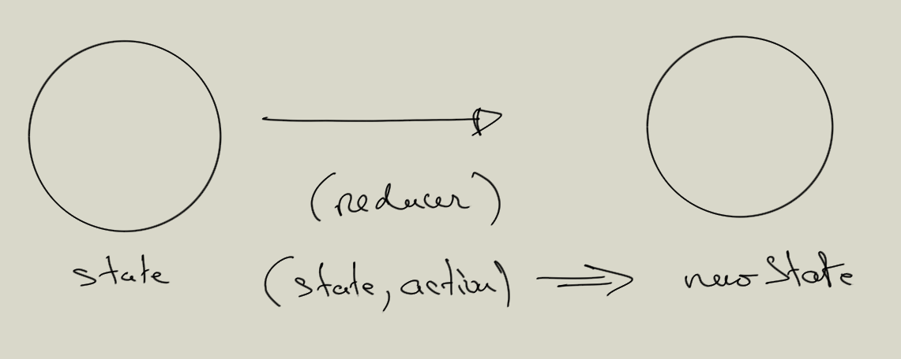

# Les Hooks

React à introduit des Hooks depuis la version 16.8.0, ils donnent par exemple la possibilité de gérer les states directement dans une fonction. Les Hooks permettent de rendre le code plus modulable et plus performant.

Les Hooks permettent d'introduire la programmation fonctionnelle.

## Règles pour l'utilisation des Hooks

- Vous ne devez pas appeler les Hooks dans des boucles.

- Vous ne devez pas les appeler dans des if.

- N'appelez pas les Hooks dans des fonctions imbriquées.

- N'appelez pas les Hooks depuis des fonctions JS.

En suivant ces règles, vous garantissez que les Hooks sont appelés dans le même ordre à chaque affichage du composant.

Il existe un plugin qui vous permettra de respecter ces règles lors du développement de votre application :

```bash
npm install eslint-plugin-react-hooks --save-dev
```

Théoriquement dans create-react-app ces règles sont bien vérifiées.

## La gestion du state avec des Hooks

Pour définir les states dans une fonction vous utiliserez useState.

```js

const TestState = (props) =>{
  // Définition du state avec useState 2 paramètres respectivement:
  // 1. Variable pour le state.
  // 2. Fonction qui mettra à jour le state.
  const [count, setCount] = React.useState(0);

  return (
      <div>
        <p>Hello World {count}</p>
        <button onClick={() => setCount(count + 1) } >
          click me
        </button>
      </div>
    );
}

ReactDOM.render(
  <TestState />,
  document.getElementById('root')
);
```

**Avantages:**

Le hook useState permet de définir un state et sa fonction de mise à jour en même temps.

Vous pouvez avoir plusieurs useState par composant.

La fonction setCount est plus simple à appeler.

\newpage

## useEffect

Vous pouvez gérer le life cycle à l'aide du hook **useEffect**. Ce dernier sera exécuté lors du **montage** de l'élément dans le DOM et lorsque les ou un state (spécifique) **sera/sont modifié(s)**. Ce hook possède également une fonction dite de nettoyage qui pourra être exécutée dans le cas où le composant est démonté du DOM.

Le useEffect factorise les trois fonctions du life cycle suivantes : **componentDidMount**, **componentDidUpdate** et **componentWillUnmount**.

Voyez l'exemple qui suit :

```js
const Counter = () => {
  const [count, setCount] = React.useState(0);

  // Au montage la première fois.
  // Et dès que le state change.
  React.useEffect(() => {
    setTimeout(() => {
      console.log(`First message: You clicked ${count} times`);
    }, 1000);
  });

  // Au montage la première fois.
  // Dès que le state change.
  React.useEffect(() => {
    setTimeout(() => {
      console.log(`Second message: You clicked ${count} times`);
    }, 1000);
  });

  return (
    <div>
      <p>You clicked {count} times</p>
      <button onClick={() => setCount(count + 1)}>
        Click me
      </button>
    </div>
  );
}
```

**Il y a un inconvénient** à cette approche car dès que l'on modifie le state tous les Hooks useEffects sont appelés.
Pour remédier à ce problème vous pouvez cibler le state en deuxième paramètre de useEffect. Ainsi si un state particulier est modifié on ré-exécute uniquement le code du useEffect concerné :

```js
const Counter = () => {
  const [count1, setCount1] = React.useState(0);
  const [count2, setCount2] = React.useState(0);

  // Au montage uniquement.
  // Puis dès que le state count1 est modifié.
  React.useEffect(() => {
    setTimeout(() => {
      console.log(`First message: You clicked ${count1} times`);
    }, 1000);
  }, [count1]);

  // Au montage uniquement.
  // Puis dès que le state count2 est modifié.
  React.useEffect(() => {
    setTimeout(() => {
      console.log(`Second message: You clicked ${count2} times`);
    }, 1000);
  }, [count2]);

  return (
    <div>
      <p>You clicked {count1} & {count2} times</p>
      <button onClick={() => setCount1(count1 + 1)}>
        First
      </button>
       <button onClick={() => setCount2(count2 + 1)}>
        Second
      </button>
    </div>
  );
}
```

Dans certain cas vous pouvez indiquer à React **de n'exécuter qu'une seule fois**, au montage (après le premier affichage), le code se trouvant dans useEffect. Il faudra alors passer en deuxième paramètre un tableau vide. Cela indique à React que votre **effet** (code dans useEffect) ne dépend d’aucune valeur issue d'un state (local), donc il n’a jamais besoin d’être ré-exécuté...


```js
useEffect(() => {

  // faire quelque chose au montage du composant React
  
}, []);
```

## Fonction de nettoyage de useEffect

Dans la fonction **useEffect** nous pouvons également appeler une méthode pour faire quelque chose lorsque :

- Soit nous démontons le composant du DOM.
- Soit lorsque React nettoie les effets du rendu précédent. Dans ce cas useEffect est lié à une/des variable(s) du state.

Vous pouvez implémenter ces fonctionnalitées en définissant dans le premier paramètre de la fonction useEffect une fonction de retour, voyez l'exemple qui suit :

```js
useEffect(() => {

  return ()=> {
    // à chaque fois que active change de valeur & au démontage du composant
  }  
}, [active]);
```

Si on souhaite exécuter une fonction de nettoyage uniquement au démontage on ne liera pas le useEffect à un state :

```js
useEffect(() => {

  return ()=> {
    // quelque chose uniquement au démontage du composant
  }  
}, []);
```

```js
const Counter = () => {
    const [count, setCount] = React.useState(0);

    React.useEffect(
      () => {
          console.log(`First message: You clicked ${count} times`);
          // Cleanup
          // Lorsqu'on démonte l'élément Counter du DOM.
          // Lorsque React met à jour le state count.
          return () => { console.log('unmount component'); }
    },
      [count]
    );

    return (
      <div>
        <p>You clicked {count} times</p>
        <button onClick={() => setCount(count + 1)}>
          Click me
        </button>
      </div>
    );
  }
```

**Remarque :**

Notez que c'est très pratique par exemple lorsqu'on doit se désabonner d'un service pour éviter les fuites mémoires.

### Exercice Counter V1

En n'utilisant que des Hooks et des fonctions pour définir des composants.

Créez un compteur dans un composant App et y implémenter un bouton toggle qui affichera le compteur :


Après avoir cliquer sur le bouton toggle, affichez le compteur :


Le deuxième bouton start/restart permettra de déclencher le compteur ou de le relancer.

Au démontage du composant Counter, pensez à arrêter le compteur.

Dans useEffect pour récupérer l'état précédent du state utiliser la syntaxe suivante :

```js
  // Dans un useEffect setCount(count + 1) réinitilisera le state
  setCount(count => count + 1)
```

### Exercice Counter V2

Dans cette deuxième version implémenter trois boutons start, stop et reset respectivement :

- Après avoir cliqué sur toggle affichez deux boutons start et stop.

- Lorsqu'on clique sur start on déclenche le compteur, il est disabled et le bouton stop est cliquable.

- Si on appuie sur le bouton stop on arrête le compteur et le bouton start est cliquable.

- Le bouton reset n'apparaît que lorsque le compteur affiche au moins 1 ou plus. Si on clique dessus on revient dans l'état start cliquable et stop disabled, le compteur repart de 0.

### Exercice API fetch

Vous allez maintenant utiliser l'API fetch de JS pour rechercher des utilisateurs. Utilisez l'url suivante :

```js
const url = `https://jsonplaceholder.typicode.com/users`;
```

- 1. Faites un moteur de recherche, sur le name des users que vous avez récupérez dans la variable users. Dans la partie Search créez un formulaire de recherche : un champ de saisi et un bouton pour lancer la recherche à proprement dite.


La recherche se fera sur le variable name de la variable users.

Vous implémenterez une recherche de votre choix par exemple vous pouvez rechercher dans la variable name de users un nom exacte ou faire une recherche plus large en testant si un caractère est présent dans cette chaîne de caractères. Utilisez la méthode **includes** de JS :


```js
"Bonjour".includes("B") // true
"Bonjour".includes("Bonjour") // true

"Bonjour".includes("X") // false
```

```txt

search : []
[Ok]

```

Une deuxième version de la recherche, faite un autre fichier on vous inspirant de ce que l'on vient de faire pour faire ce deuxième moteur de recherche

2. On voudrait faire un petit moteur de recherche comme suit, en tapant les premières lettres on afficherait le résultat sous le champ de recherche :


\newpage

Faites les composants fonctionels suivants, le composant Search récupère dans un formulaire la recherche et le composant Users sera dédié à la recherche elle-même.


```txt

    +--------+-------+
    |                |
    |                |
    |       App      |
    |                |
    |                |
    +--------+-------+
             |
    +--------+-------+
    |                |
    |                |
    |     Search     |
    |                |
    |                |
    +--------+-------+
             |
    +--------+-------+
    |                |
    |     Users      |
    |                |
    |                |
    +----------------+

```

## useCallback

Nous allons partir de l'exemple suivant, créez un fichier index.html classique pour tester React dans un dossier useCallback.

Dans ce fichier vous allez écrire le code suivant, nous allons utiliser l'objet Set de JS, il permet de créer un set c'est-à-dire un ensemble de données uniques. Il nous permettra aussi de compter le nombre d'instances de fonction créées durant l'exécution du script :

```js
const triggerFunc = new Set();
const App = (props) => {

  const [count, setCount] = React.useState(1);
  const [pos, setPos] = React.useState(0);

  const incrementCount = () => setCount(count => count + 1);
  const incrementPos = () => setPos(pos => pos + 1);

  return (
        <div>
            <p> Count : {count} </p>
            <p> Pos : {pos} </p>
            <p>
                <button onClick={incrementCount}>count</button>
            </p>
            <p>
                <button onClick={incrementPos}>pos</button>
            </p>
            <p> Creation de fonction(s) & nouvelles fonctions: {triggerFunc.size} </p>
        </div>
  );
}
```

Le Hook useCallback permet de mémoriser **le résultat** d'une fonction afin de pouvoir le réutiliser entre deux render sans le recalculer. Cela permet donc d'optimiser l'exécution de fonctions dans un composant. Cela devient pertinent lorsque votre fonction utilise beaucoup de ressouces.

- Renvoi une version mémoïsée de la fonction de rappel.

- Celle-ci changera uniquement si une des entrées a changé.

```js

const App = () =>{

  // renvoi une fonction de rappel mémoïsée
  // Elle changera si une des entrées change(nt)
  const myFunctionSuperResource = useCallback(() => {
      // votre fonction de rappel
  }, [])
}

```

## Exercice useCallback

Reprenons maintenant le code précédent que nous avons testé et refactorisez celui-ci avec une fonction useCallback.

Si l'une des entrée change alors la fonction de rappel change également, considérez le code suivant :

```js
const incrementCount =  React.useCallback( () => setCount(count => count + 1), [] );
const incrementPos = React.useCallback( () => setPos(pos => pos + count), []);
```

Si vous avez cliqué 3 fois sur le premier bouton incrementCount et ensuite une fois sur le bouton incrementPos, que devrait afficher le state **pos** ?

Pour résoudre ce bug vous devez indiquer à l'une ou l'autre des fonctions de callback quelle entrée change. Essayez de trouver une solution.

## useReducer

useReducer doit s'utiliser lorsque le state d'un composant devient complexe.

Un useReducer possède un reducer qui permet de prendre un state et une action et de retourner un nouveau state.

Un reducer peut être schématisé comme suit :



\newpage

Créez un fichier useReducer.html et tester le code ci-dessous :

```js

const initialState = {count: 0};

const reducer = (state, action) => {

  switch (action.type) {
    case 'incr':
      return {count: state.count + 1};
    case 'decr':
      return {count: state.count - 1};
    default:
      return state;
  }
}

function Counter() {
  const [state, dispatch] = useReducer(reducer, initialState);
  return (
    <React.Fragment>
      Counter : {state.count}
      <button onClick={() => dispatch({type: 'decr'})}>-</button>
      <button onClick={() => dispatch({type: 'incr'})}>+</button>
    </React.Fragment>
  );
}

```

### Exercice calculatrice

Vous allez faire une petite calculatrice en utilisant **useReducer** pour découvrir son principe.

Vous créez deux champs pour saisir deux nombres, puis vous ajoutez trois boutons pour respectivement additionner, multiplier et faire un reset des valeurs de la calculatrice.

Vous gérez les erreurs de saisie, interdiction de saisir autre chose qu'un numérique.

Voyez les pages suivantes pour vous faire une idée de l'exercice demandé :

\newpage


\newpage


\newpage


\newpage

## Exercice saisie des notes

Installez un squelette d'application avec create-react-app.
Puis créez un formulaire pour saisir des notes, 10 maximuns. Une fois ces 10 notes saisies affichez la moyenne de celles-ci juste en dessous du formulaire.

Options : (1) une fois les 10 notes saisies on ne pourra plus saisir de notes dans le formulaire. (2) Ajoutez un coefficient à chaque note.

Affichez maintenant dans une sidebar toutes les notes saisies.

Implémentez également une action sur un bouton pour supprimer toutes les notes.

## useRef

Ce Hook renvoie une référence modifiable dont la propriété current peut être initialisée.

Il vous donnera pour chaque render le même objet.

```js

const InputText = () => {
  const inputRef = useRef(null);

  const onButtonClick = () => {
    // `current` fait référence au champ textuel monté dans le DOM
    // recalculer à chaque fois que ce dernier change
    inputEl.current.focus();
  };

  return (
    <>
      <input ref={inputEl} type="text" />
      <button onClick={onButtonClick}>Donner le focus au champ</button>
    </>
  );

}
```
